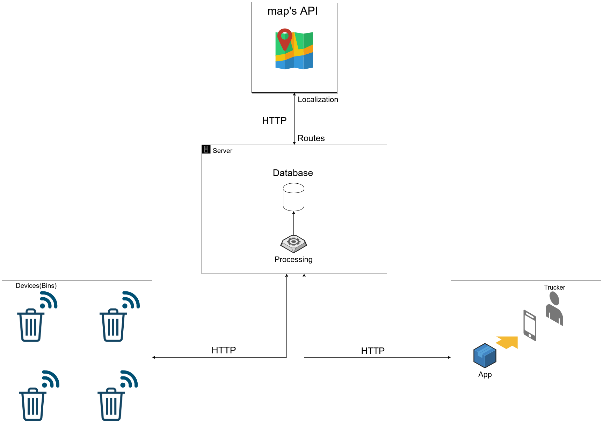

 
# Smart_Collect

## About

	This repository was developed for IoT class.
 	Smart_collect is a aplication for trash's truck management in a city.
 	It will use sensors and GPS at bins, to know how full is a bin and its location.
 	Then traces a optimizated route for Truckers.
---
## Architeture

---
## Technologies
* Python 
* Cherrypy
  
 